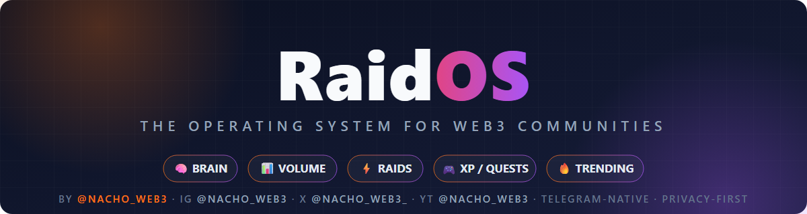

<p align="center">
  
</p>

<h1 align="center">RaidOS</h1>

<p align="center">
  <strong>The operating system for Web3 communities.</strong><br>
  Telegram-native · Self-hosted · Privacy-first · AI via Ollama
</p>

<p align="center">
  <sub>Created by <strong>@nacho_web3</strong> — <a href="https://instagram.com/nacho_web3">Instagram</a> · <a href="https://x.com/nacho_web3_">X</a> · <a href="https://youtube.com/@nacho_web3">YouTube</a></sub>
</p>

---

RaidOS is not "another Telegram raid bot". It is a complete operating system for
token communities, built on five layers that feed each other:

| Layer | Module | What it does |
|---|---|---|
| 🧠 **Intelligence** | Community Brain | Reads the group (locally, privately), clusters recurring questions, answers members from official info only, briefs admins |
| 📊 **Market** | Volume Intelligence | Turns real on-chain activity into readable cards and alerts — never fabricated |
| ⚡ **Activation** | Raid Engine | Coordinates real community engagement with honest, self-reported tracking |
| 🎮 **Retention** | XP · Quests · Badges | Rewards genuine contribution with XP, levels, streaks, missions and badges |
| 🔥 **Discovery** | Trending *(planned)* | Ranks what is gaining real momentum, organic vs. sponsored |

Everything feeds the intelligence layer — the product loop:

```
COMMUNITY → CONVERSATION → BRAIN → INTELLIGENCE → CONTENT / RAID
    ↑                                                      ↓
  NEXT ACTION ← MARKET ACTIVITY ← VOLUME INTELLIGENCE ← ENGAGEMENT
```

> **Honesty rules baked into the code:** participation is always labeled
> **SELF-REPORTED**, alerts only fire on real data, reasons are never claimed
> unless the data supports them, and there are no fake users or fake volume — ever.

---

## 📦 Installation

### Requirements

- **Node.js 22+** — [nodejs.org](https://nodejs.org)
- **Ollama** — [ollama.com](https://ollama.com) (all AI runs locally on your machine)
- A **Telegram bot token** from [@BotFather](https://t.me/BotFather)

### 1. Install Ollama and pull the models

```bash
# Linux / macOS
curl -fsSL https://ollama.com/install.sh | sh

# Windows: download the installer from ollama.com, then:
ollama pull llama3.2:3b      # chat model (~2 GB)
ollama pull nomic-embed-text # embedding model (~274 MB)
```

### 2. Create your bot

Talk to [@BotFather](https://t.me/BotFather) on Telegram → `/newbot` → copy the
token. Also grab your numeric Telegram user id (e.g. from @userinfobot) — that
becomes the bot owner.

### 3. Configure

```bash
cd packages/core
cp .env.example .env
```

Edit `.env`:

```ini
BOT_TOKEN=123456:ABC-DEF...          # from @BotFather
OWNER_ID=123456789                   # your numeric Telegram id
# GROUP_ID=-1001234567890            # optional: pin the bot to one group
OLLAMA_BASE_URL=http://127.0.0.1:11434
CHAT_MODEL=llama3.2:3b
EMBED_MODEL=nomic-embed-text
DB_PATH=./brain.db                   # SQLite, created automatically
```

### 4. Run

```bash
npm install
npm run build
npm start
```

You should see:

```
🧠 Community Brain online as @yourbot
   AI: ollama:llama3.2:3b (embed: nomic-embed-text) · mock=false
```

Add the bot to your community group and run **`/setup`** there to activate it.

### Running it forever (optional)

On a server, keep it alive with pm2:

```bash
npm i -g pm2
pm2 start "node dist/index.js" --name raidos
pm2 save
```

---

## 🕹 Usage

### First 5 minutes

| Step | Command |
|---|---|
| 1. Add the bot to your group and run | `/setup` |
| 2. Teach it your official answers | `/learn The fair launch was at 12:00 UTC.` |
| 3. Let members ask | `/ask when was fair launch?` |
| 4. See what the community keeps asking | `/brain` |

That's the core loop: **the bot listens, learns your official answers, and
deflects the same question before you answer it 50 times.**

### 🧠 Intelligence commands

| Command | Who | What |
|---|---|---|
| `/ask <question>` | everyone | Answered from the knowledge base **only** — if it doesn't know, it says so. Never invents. |
| `/learn <fact>` | admin | Add an official fact to the knowledge base |
| `/kb` · `/kbdel <n>` | admin | List / remove knowledge entries |
| Pin a message | admin | Pinned messages are auto-saved to the knowledge base |
| `/memory` | admin | What the brain has captured recently |
| `/brain` | admin | Full briefing: memory, stats, AI-recommended actions |
| `/stats` | admin | Activity numbers |
| `/config` | admin | Toggle the brain / alerts per chat |

> **Privacy:** message text never leaves the machine (Ollama runs locally) and
> message bodies are purged after `retentionDays` — only aggregates survive.

### 🎮 Retention commands

| Command | Who | What |
|---|---|---|
| `/rank` | everyone | Your level, XP, streak and badges |
| `/top` | everyone | Community leaderboard |
| `/badges` | everyone | Your earned badges (auto-awarded on milestones) |
| `/quests` | everyone | Active missions and your progress |
| `/quest add <name> \| <kind> \| <target> \| <XP>` | admin | Create a mission — kinds: `messages`, `reactions`, `invites`, `meme_submissions`, `poll_votes`, `raids` |

Example: `/quest add Community builder | invites | 3 | 500` → anyone who
invites 3 members completes it and earns 500 XP.

### ⚡ Raid Engine

Raids turn community attention into organized, measurable, **real** engagement.
Members join, do the actions manually, and check in after each one — everything
is labeled **SELF-REPORTED** because the bot never claims a platform verified it.

```text
/raid create SAUR Launch | x | https://x.com/project/status/123 | 30m | 500 | 100
/raid join 1        ← members join
/raid in 1          ← ...do one action on X, then check in (cooldowns apply)
/raid score 1       ← live: participants, tracked actions, completion, velocity
/raid end 1         ← close + full report
/raid top           ← community raider leaderboard
/raid list          ← active raids
```

Anti-abuse is built in: check-in cooldown, per-raid action cap, diminishing XP
per extra action, daily raid-XP cap, participant caps.

### 📊 Volume Intelligence

Track your token and turn market activity into community-readable intelligence:

```text
/volume set <tokenAddress> SAUR dexscreener   ← admin: start tracking
/volume                                        ← full market card
/volume alerts                                 ← admin: toggle automatic alerts
```

`/volume` renders:

```text
📊 $SAUR MARKET INTELLIGENCE
Price: $0.000042
24H Volume: $182K · Liquidity: $74K
Buys: 1,284 · Sells: 917 (B/S 1.40)
24H Change: +37%
Volume trend: 🔥 ACCELERATING
Source: dexscreener
```

With alerts on, a background poller (5 min) fires threshold-based alerts:
🔥 volume spike · 📈 breakout · 📉 drop · 💧 liquidity change · 🚨 drain.
Providers are pluggable (`MarketDataProvider` interface): DexScreener ships
keyless, more chains/providers plug in without touching the app.

### 😹 Meme contests

```text
/meme open Meme Friday 24h     ← admin opens submissions
/meme submit <text or link>    ← members enter
/meme voting                   ← admin closes submissions, opens voting
/meme vote 7                   ← members vote
/meme finish                   ← admin crowns the winner (+XP)
/meme list                     ← current contest and scores
```

---

## 🗂 Repository layout

```
packages/core/            RaidOS core (Telegram bot + intelligence)
├── src/
│   ├── index.ts          Bot wiring: commands, listeners, background jobs
│   ├── database/db.ts    SQLite (better-sqlite3): 17 tables, one per-tenant DB file
│   ├── modules/          brain logic: kb, analyzer, xp, quests, badges, memes, raids…
│   ├── market/           Volume Intelligence: providers (DexScreener, mock), alerts
│   ├── ai/               Ollama provider (chat + embeddings), local only
│   └── config.panel.ts   /config settings panel
├── tests/                57 unit + integration tests (vitest)
└── .env.example
docs/
├── assets/               Banner & brand assets
└── superpowers/          Design specs & plans
```

The database auto-migrates: new tables are added alongside existing data on
startup, so upgrading never loses your community's history.

## 🧪 Development

```bash
cd packages/core
npm run dev        # build + run locally
npm test           # 57 tests
npm run typecheck  # strict TypeScript
```

## 🗺 Roadmap

- **Trending engine** — rank tokens/topics by real, measurable signals; sponsored slots always labeled `SPONSORED`
- **Raid analytics** — post-raid reports + Community Brain post-raid insights (confusion delta, message velocity)
- **Unified momentum alerts** — market + social signals in one data-driven alert
- **Web dashboard** — community, token, raids, trending and gamification in one command center
- **More chains & providers** — Birdeye, GeckoTerminal, configurable RPC behind the same interface

## ❓ FAQ

**Does this make fake volume or spam?**
No. By design. It detects and amplifies real activity, and every engagement
number it shows is either measured or explicitly labeled `SELF-REPORTED`.

**Does my community's data leave my server?**
No. AI runs through local Ollama; there are no cloud API calls. Message text is
purged after the retention window.

**Can I use it without the market features?**
Yes — everything except `/volume` works out of the box. Set a token whenever
you're ready.

## 👤 Creator

RaidOS is built and maintained by **@nacho_web3**.

| Platform | Handle |
|---|---|
| 📸 Instagram | [@nacho_web3](https://instagram.com/nacho_web3) |
| 🐦 X (Twitter) | [@nacho_web3_](https://x.com/nacho_web3_) |
| ▶️ YouTube | [@nacho_web3](https://youtube.com/@nacho_web3) |
